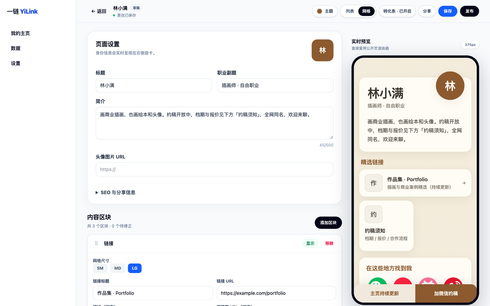
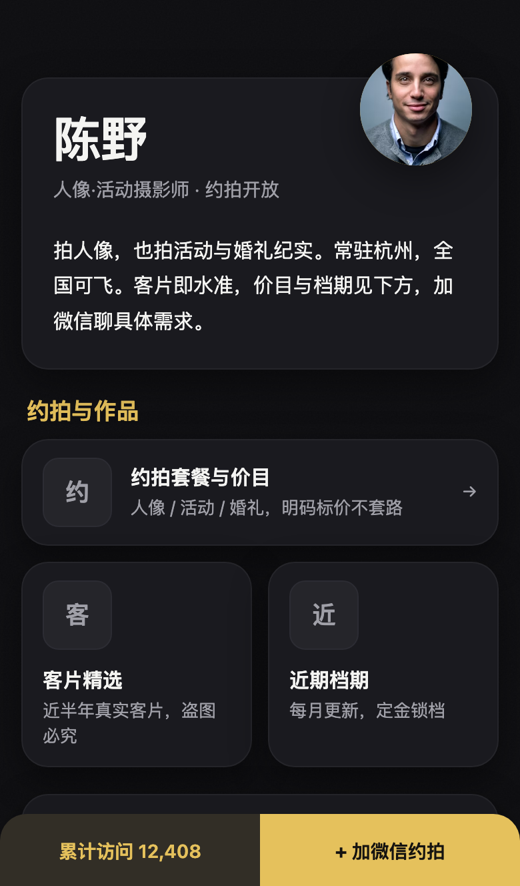
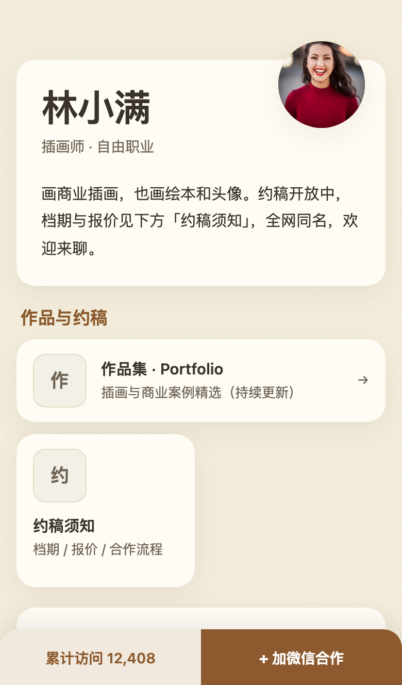

# 一链 YiLink

[English](README.en.md)

> **一条链接，装下你的全部主页。**

<p align="center">
  
  
  
</p>

**在线体验：** [yilink.app](https://yilink.app) · [真实演示主页](https://yilink.app/p/demo-photographer)

[](LICENSE)
[](https://github.com/zhangfeite/yilink/actions/workflows/ci.yml)

一链 YiLink 是面向中文创作者和团队的开源 link-in-bio 与数字名片应用，可自托管发布个人主页、二维码和链接集合。

## 特性

- 场景模板：内置 8 组创作者与个人品牌场景模板。
- 主题系统：提供 8 套可切换主题，并支持列表与网格布局。
- 微信分发适配：公开页兼顾微信内置浏览器、复制链接与二维码分发场景。
- 二维码与海报工作流：支持主页二维码下载，以及在浏览器中生成主题化分享海报。
- 统计：记录公开页访问和链接点击，并提供近 30 天汇总。
- 审核：发布时运行本地词库审核，并提供审核记录与管理入口。
- 自部署：默认使用 SQLite，提供 Docker Compose 部署路径。

## 快速开始

### Docker Compose

在仓库根目录执行。先打开 <code>docker/.env</code>，为 <code>AUTH_SECRET</code> 设置高强度随机值，并将 <code>AUTH_URL</code> 改为实际访问地址。

```bash
cp docker/.env.example docker/.env
docker compose --project-name yilink --env-file docker/.env -f docker/docker-compose.yml up -d --build
docker compose --project-name yilink --env-file docker/.env -f docker/docker-compose.yml ps
```

首次启动会在应用启动前执行已提交的 Prisma migration。默认服务地址是 <http://localhost:3000>。完整的初始化、升级和备份流程见 [Docker 部署文档](docs/deploy/docker.md)。

### 源码模式

需要 Node.js 20 或更高版本，以及仓库声明的 pnpm 版本。

```bash
corepack enable
pnpm install --frozen-lockfile
cp apps/web/.env.example apps/web/.env
pnpm db:migrate
pnpm db:seed
pnpm dev
```

<code>pnpm db:seed</code> 是可选的，会写入三个演示主页；开发服务器启动后可访问 <http://localhost:3000/p/demo-photographer>。

## 配置

源码模式从 <code>apps/web/.env</code> 读取配置。Docker Compose 使用 <code>docker/.env</code>，其模板已为持久化 SQLite 卷设置了正确的数据库路径。

| 变量                                                                                     | 必填       | 说明                                                                                                      |
| ---------------------------------------------------------------------------------------- | ---------- | --------------------------------------------------------------------------------------------------------- |
| <code>DATABASE_URL</code>                                                                | 是         | Prisma 数据库连接。源码默认使用相对路径 SQLite；Docker 默认使用挂载到 <code>/data</code> 的 SQLite 文件。 |
| <code>AUTH_SECRET</code>                                                                 | 生产环境是 | Auth.js 会话密钥。生产环境必须使用至少 32 字节的随机值。                                                  |
| <code>AUTH_URL</code>                                                                    | 建议       | 应用的外部访问地址，例如 <code>https://links.example.com</code>。                                         |
| <code>GITHUB_ID</code>                                                                   | 否         | GitHub OAuth App Client ID；与 Secret 同时设置时启用 GitHub 登录。                                        |
| <code>GITHUB_SECRET</code>                                                               | 否         | GitHub OAuth App Client Secret。                                                                          |
| <code>PAGES_HOST</code>                                                                  | 否         | 公开主页独立域名。设置后该域名的根路径和单段路径会映射为公开主页。                                        |
| <code>NEXT_PUBLIC_APP_URL</code>                                                         | 否         | 未设置 <code>PAGES_HOST</code> 时，二维码生成使用的公开应用地址。                                         |
| <code>NEXT_PUBLIC_GITHUB_URL</code>                                                      | 否         | 营销页 GitHub 链接；默认指向 <code>github.com/zhangfeite/yilink</code>。                                  |
| <code>REPORT_EMAIL</code>                                                                | 否         | 营销页与公开页使用的举报邮箱；默认 <code>report@yilink.app</code>。                                       |
| <code>LEMONSQUEEZY_WEBHOOK_SECRET</code>                                                 | 否         | LemonSqueezy Webhook 的 HMAC-SHA256 密钥；未设置时回调接口拒绝处理请求。                                  |
| <code>LEMONSQUEEZY_VARIANT_MINI</code> / <code>LEMONSQUEEZY_VARIANT_PRO</code>           | 否         | 两个买断套餐对应的 LemonSqueezy variant ID，用于把已支付订单映射到套餐。                                  |
| <code>LEMONSQUEEZY_CHECKOUT_URL_MINI</code> / <code>LEMONSQUEEZY_CHECKOUT_URL_PRO</code> | 否         | 两个套餐的 HTTPS 结账链接；未配置时营销页显示「即将开放」，两个都有效时设置页展示升级入口。               |
| <code>NEXT_PUBLIC_PRICE_MINI</code> / <code>NEXT_PUBLIC_PRICE_PRO</code>                 | 否         | 营销页与设置页显示的套餐价格文案，默认分别为 <code>$12</code> 与 <code>$25</code>。                       |

当前 Prisma datasource 是 SQLite。海外托管的官方路径是 [Cloudflare Workers + D1](docs/deploy/cloudflare.md)（D1 与 SQLite 同方言，迁移零改造，本地已验证全链路）。Vercel 路径见 [说明](docs/deploy/vercel.md)，需先完成 PostgreSQL 兼容改造。

## 境内部署合规提示

在中国境内部署前，请阅读 [境内部署合规指引](docs/deploy/compliance-cn.md)。它覆盖 ICP 与公安备案、多用户 UGC 运营边界，以及内容审核的部署建议。文档不构成法律意见；部署者应按自身业务、地区和服务形态核实要求。

## 架构

```text
浏览器 / 二维码访问
          │
          ▼
Next.js 应用（apps/web）
 ├─ 公开主页、编辑器、认证与 API
 ├─ packages/shared：数据 schema 与公共工具
 ├─ packages/icons：平台图标
 └─ packages/moderation：审核 provider 接口
          │
          ▼
Prisma ── SQLite（Docker named volume）
```

## Roadmap

后续迭代以 [PRD](docs/PRD.md) 为准，当前重点包括：

- V1.x：自定义域名、活码、自由网格编辑器、模板画廊、主题投稿、媒体资料卡，以及统计增强。
- V2：微信小程序名片、预约或表单区块、第三方收款链接、AI 生成初稿和团队/矩阵管理。

## 参与贡献

请阅读 [贡献指南](CONTRIBUTING.md)，其中说明了本地开发、检查命令、评审流程与依赖许可证要求。

## License

本项目采用 [Apache License 2.0](LICENSE) 发布。第三方致谢见 [NOTICE](NOTICE)。
